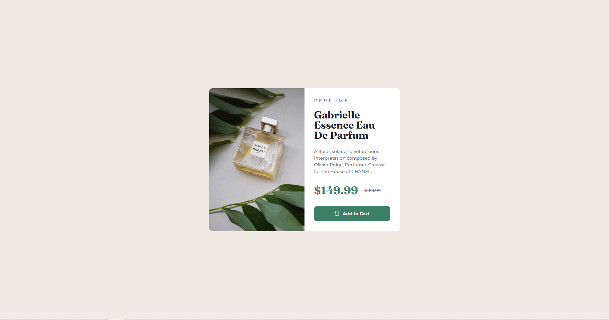

# Frontend Mentor - Product preview card component solution

This is my solution to the [Product preview card component challenge on Frontend Mentor](https://www.frontendmentor.io/challenges/product-preview-card-component-GO7UmttRfa). It is my third Frontend Mentor challenge! Frontend Mentor challenges help you improve your coding skills by building realistic projects. 

Challenge Level: 1 -> Newbie 🟢

🕒 Estimated time: 3h
🕑 Time taken:     2h

## Table of contents

- [Overview](#overview)
  - [The challenge](#the-challenge)
  - [Screenshot](#screenshot)
  - [Links](#links)
- [My process](#my-process)
  - [Built with](#built-with)
  - [What I learned](#what-i-learned)
- [Author](#author)

## Overview

### The challenge

Users should be able to:

- View the optimal layout depending on their device's screen size
- See hover and focus states for interactive elements

### Screenshot

Here is a screenshot of my solution:



### Links

- Link to the solution: [Product card challenge](https://www.frontendmentor.io/solutions/challenge-3-product-preview-card-challenge-using-react-YXePzeb14K)
- Live Site URL: [See solution on my live site](https://frontend-mentor3-product-card.vercel.app/)

## My process

### Built with

- HTML
- CSS
- JavaScript
- [React](https://reactjs.org/) - JS library

### What I learned

It was pretty similar to the QR code challenge (my first challenge), except that this challenge had to be responsive. So it was nice to review how to use media queries again. It is funny that I used ```text-decoration: line-through;``` for the first time because I`d never had to use it before :) I had to use it here to cross out the old price in the Product Card. 

Also, this time I finished the project one hour earlier than expected because I had nearly no problems, unlike my last project where I had some troubles with the JSON file icons. 

## Author

- Frontend Mentor - [@Orchi1904](https://www.frontendmentor.io/profile/Orchi1904)
- LinkedIn - [Alexej Kunz](https://www.linkedin.com/in/alexej-kunz/)
